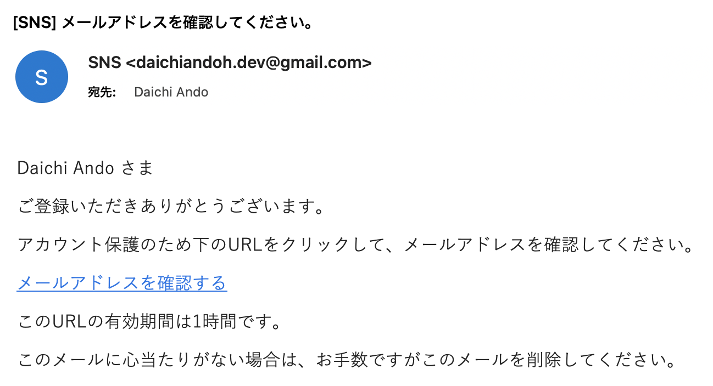
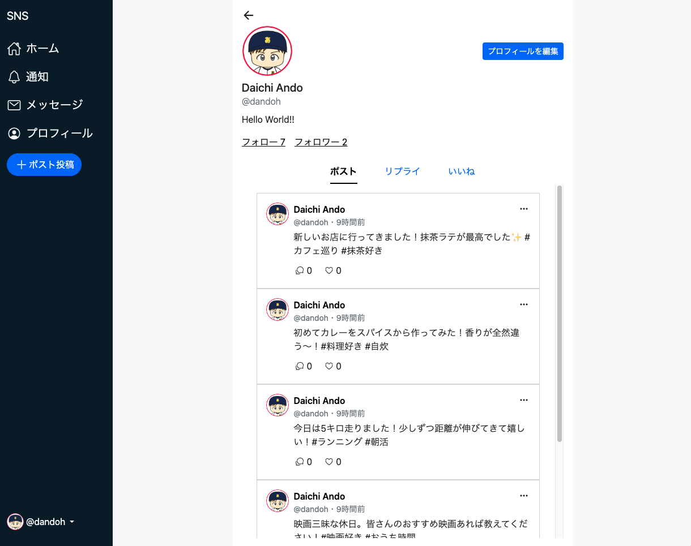

# social-networking-service


## URL

https://sns.d-andoh.com/

## アプリケーション

### 概要

このアプリケーションは、Social Networking Serviceです。
ユーザー同士が画像やテキストコンテンツを通してやりとりすることができます。
また、テキストベースのリアルタイムチャット機能やユーザー間のフォロー機能なども備えており、ユーザー同士のコミュニケーションを活発化させます。

### 機能

- ユーザーアカウント関係
    - ユーザー登録
    - ユーザーログイン
    - パスワードリセット
    - ユーザー情報設定
- ポスト関係
    - ポスト投稿
    - リプライ投稿
    - ポスト予約投稿
    - ポスト（リプライ）削除
    - ポストいいね
    - タイムライン
        - トレンドタイムライン
        - フォロータイムライン
- チャット機能
    - リアルタイムチャット
- その他
    - 通知
        - フォロー, リプライ, いいね, チャットメッセージ受信

### 使用方法（画面キャプチャと説明）

#### トップ画面


#### ユーザー認証

ユーザー登録時にはメールアドレス検証が求められます。




ユーザーログインでは、登録済みのユーザー情報でログインしてください。<br>
パスワードリセットも行うことができます。


#### タイムライン

タイムラインはタブでトレンドタイムラインとフォロータイムラインを切り替えることができます。<br>
トレンドタイムラインは直近1週間のポストをいいね数が多い順で表示します。<br>
フォロータイムラインは自分自身とフォロワーのポストをポスト作成日順で表示します。


#### ポスト

サイドメニューのポスト作成ボタンをクリックすると、ポスト作成モーダルが開きます。<br>
作成フォームの予約チェックを有効にし、日時を設定することで、ポスト投稿を予約できます。


ポスト左下のリプライアイコンをクリックすると、当該ポストに対するリプライポストを作成できます。<br>
リプライポストは投稿予約はできません。


ポスト右上の3点ドットアイコンをクリックすると、削除ボタンが表示されます。<br>
自分自身が投稿したポストであれば削除できます。


#### ポスト詳細

ポストをクリックすると、ポスト詳細画面に遷移します。<br>
当該ポストとそのポストに紐づくリプライポストが表示されます。<br>
もし表示対象ポストがリプライポストの場合は、リプライ元ポストも表示します。


#### ユーザープロフィール

サイドメニューの「プロフィール」またはユーザー情報（アイコン, ユーザーの名前など）をクリックすることでユーザープロフィール画面に遷移します。<br>
ユーザープロフィール画面では、ユーザー情報と、そのユーザーに紐づくポストが「ポスト」「リプライ」「いいね」別で表示されます。




フォロー、フォロワーのリンクを押すと、それぞれのユーザー一覧が表示されます。


また、ユーザープロフィール画面は、表示対象ユーザーによって表示が少し異なります。<br>
自分自身のユーザーであれば、プロフィール編集ボタンが表示され、プロフィール情報を編集できます。


自分以外のユーザーであれば、フォロー状況に応じたボタンが表示されます。
また、自分以外のユーザーで自分のことをフォローしている場合は、フォローラベル（「フォローされています」というテキストラベル）が表示されます。


インフルエンサーユーザーの場合は、インフルエンサーバッチが表示されます。<br>
このバッチはユーザープロフィール画面だけでなく、ユーザー情報が表示される全ての箇所で表示されます。


#### メッセージ

ユーザー同士でテキストベースのリアルタイムチャットを行えます。
自分以外のユーザーのユーザープロフィール画面にあるチャットアイコン（下の画像であれば、フォローボタンの左横のアイコン）をクリックすると、当該ユーザーとのチャットページに遷移します。


サイドメニューの「メッセージ」をクリックすると、既にチャットを行っているユーザーの一覧が表示されます。


#### 通知

サイドメニューの「通知」をクリックすると、自分以外のユーザーからの各種アクション通知を確認することができます。通知対象となるアクションは以下です。

- 自分の投稿へのいいね
- 自分の投稿へのリプライ
- 自分のことをフォロー
- 自分へのチャットメッセージ

各通知レコードをクリックすると、当該通知に対応する画面に遷移します。<br>
また未確認のレコードの背景色は水色となり、サイドメニューにも未確認通知数がバッチ表示されます。


#### SP版

SP版のスタイルも設定しています。


## 開発

### ソースコードアーキテクチャ

#### 概要

このコードベースは、主にWebアプリケーション開発の学習を目的としたものになっています。<br>
ここでのWebアプリケーション開発の学習とは、単に仕様を満たし、
問題なく動作するWebアプリケーションを開発することではなく、
Webアプリケーション開発における様々な要素を、より深く理解することに主眼を置いています。<br>
そのため、高いレベルで抽象化されたライブラリやフレームワークの使用を極力控えています。<br>
独自のマイクロフレームワークを構築し、ライブラリやフレームワークが提供しているような部分も、自ら実装しています。

このアプリケーションは、CSRを採用しています。<br>
フロント側のコンテンツを配信し、ブラウザで実行されるJavaScriptによりAPIからデータを取得してレンダリングします。

#### ディレクトリ構造と説明

主要なディレクトリの一覧と簡単な説明です。

```
social-networking-service/
├ docs // ドキュメンテーション関連（アプリケーション自体に関係なし）
├ public // 公開されるファイル, この中の index.php がアプリケーションのエントリーポイント
├ scripts // コマンド実行等、スクリプトとして実行されるファイル
├ src // アプリケーションのソースコード
│ ├ Commands // コマンドプログラム関連
│ ├ constants // 定数ファイル
│ ├ Database // データベース関連
│ ├ Exceptions // 例外
│ ├ Helpers // ヘルパークラスファイル
│ ├ Middleware // ミドルウェア関連
│ ├ Models // モデルオブジェクト関連
│ ├ Response // レスポンスオブジェクト関連
│ ├ Routing // 各種エンドポイントとその処理をまとめたルーティングファイル
│ ├ Types // データ型定義ファイル
│ ├ views // viewファイル関連
│ └ Ws // WebSocket関連
├ ...
├ ...
...
```

##### アプリケーション関連

アプリケーションとしては、`public/index.php` がエントリーポイントとなります。<br>
`public/index.php` は、`src/Routing/**-routes.php` を用いて、アクセスに応じた処理を実行します。

先述の通り、このアプリケーションはCSRを採用しています。<br>
そのため、`src/Routing/**-routes.php` には、`ui-routes.php` と `api-routes.php` の2つのルーティングファイルが存在します。
`ui-routes.php` はフロント側の静的コンテンツをHTMLレスポンスとして返すルートを、`api-routes.php` はAPIのデータをJSONレスポンスとして返すルートを定義しています。<br>

`ui-routes.php` は、基本的にはそのルートに紐づくviewファイルを返すのみです。

`api-routes.php` は、必要な処理を行い、JSONでレスポンスを返します。<br>
データが必要な場合は、DAOを用いてデータベースにアクセスします。
DAOは、データベースからデータを取得し、データベースレコードとModelオブジェクトをマッピングします。<br>
また、汎用的な処理は、ヘルパークラスとして定義しており、それらも適宜利用しながら、レスポンスデータを作成します。

##### スクリプト関連

各種処理を行うスクリプトは、`scripts/` に存在します。

`scripts/console` はデータベースマイグレーション等のコマンドプログラムのエントリーポイントとなります。
コマンドプログラムについては、以降で別途説明項目がありますので、そちらをご覧ください。

`scripts/ws_server_runner` は、リアルタイムチャットで使用するWebSocketサーバーを起動します。

### アプリケーションアーキテクチャ

インフラストラクチャーは、AWSで構築しています。<br>
アーキテクチャはシンプルで、EC2サーバーでアプリケーションを実行し、データベースはRDSを使用しています。
現在（2024/11/02時点）は、AWS無料利用枠におさめるために、マルチAZによる冗長化などは対応していません。

[TODO: アプリケーションアーキテクチャ図をここに表示させる]

### 設計図

#### ER図


#### 状態遷移図


#### ユースケース図


#### アクティビティ図（ユーザー認証）


### 開発環境セットアップ

1. 環境変数設定

`.env.template` から `.env` を作成し、環境変数値を設定します。

```
$ cp .env.template .env
```

2. 依存パッケージインストール, DB初期化

```
$ composer install
$ php scripts/console migrate -i
```

3. ローカルサーバー起動

```
$ php -S localhost:8000 -t public
```

### コマンドプログラム

`scripts/console` の引数にコマンドを指定することで、コマンドプログラムを実行できます。<br>
登録されているコマンドは以下です。

#### code-gen

`[file_type]` に `migration` もしくは `seed` を指定することで、
指定した値に応じてマイグレーションファイル、シーディングファイルを作成します。
それぞれが作成されるディレクトリは以下です。

- マイグレーションファイル
  - `src/Database/Migrations`
- シーディングファイル
  - `src/Database/Seeds`

`[file_name]` は任意のファイル名を指定できますが、シーディングファイルのみ以下のような仕様が存在します。

- `[file_name]` で指定されたファイル名の末尾が `Seeder` でなければ自動的に追加する

```
$ php scripts/console code-gen [file_type] --name [file_name]
```

#### migrate

##### マイグレーションファイル作成

`code-gen` により作成されたマイグレーションファイルの `up` にマイグレーションロジック、`down` にロールバックロジックを記述します。

```php: Database/Migrations/yyyy-mm-dd_[unix_timestamp]_[file_name].php
<?php

namespace Database\Migrations;

use Database\SchemaMigration;

class {$className} implements SchemaMigration {
    public function up(): array {
        // TODO: マイグレーションロジックを追加
        return [];
    }

    public function down(): array {
        // TODO: ロールバックロジックを追加
        return [];
    }
}
```

##### マイグレーション実行

以下のコマンドでマイグレーションを実行します。
なお、初回実行時には `--init`（`-i`）オプションをつける必要があります。
`--init` オプションは、マイグレーションを管理するためのテーブルをDBに作成します。

マイグレーションは実行時のDBの状態とマイグレーションファイルの差分を確認し、
未反映のマイグレーションファイルをファイル作成日順で順次実行します。

```
# 初回実行時
$ php scripts/console migrate --init

# 2回目以降実行時
$ php scripts/console migrate
```

##### ロールバック

ロールバック時は、`--rollback`（`-r`）オプションを使用します。

```
$ php scripts/console migrate --rollback
or
$ php scripts/console migrate -r
```

また、ロールバックオプションに続けて整数値を設定すると、その回数分ロールバックを実行します。
オプション値を設定しない場合は、1回分ロールバックが実行されます。

```
# 現在のバージョンから2回分ロールバックする
$ php scripts/console migrate -r 2
```

#### seed

##### シーディングファイル作成

`code-gen` により作成されたシーディングファイルの `tableName` にシードデータを挿入するテーブル、
`tableColumns` にそのテーブルのカラム名とデータ型, 
`createRowData` に実際に挿入するデータを定義します。

```php: Database/Migrations/yyyy-mm-dd_[unix_timestamp]_[file_name].php
<?php

namespace Database\Seeds;

use Faker\Factory;
use Database\AbstractSeeder;

class {$className} extends AbstractSeeder {
    // TODO: tableName文字列の割り当て
    protected ?string \$tableName = null;

    // TODO: tableColumns配列の割り当て
    protected array \$tableColumns = [];

    public function createRowData(): array {
        // TODO: createRowData()メソッドの実装
        return [];
    }
}
```

##### シーディング実行

以下のコマンドでシーディングを実行します。
このコマンドでは、`src/Database/Seeds` に存在する全てのシーディングファイルが実行されます。

```
$ php scripts/console seed
```

ケースに応じたシーディングファイルのセットを実行するオプションが存在します。
`--init`（`-i`）はプロトタイプ用のデータシーディングを行います。
`--batch`（`-b`）はバッチ処理用のデータシーディングを行います。

本番サーバーでは、初回デプロイ時に、プロトタイプ用のデータシーディングを行っています。<br>
そして、バッチ処理用のデータシーディングをcronジョブで定期実行しています。<br>
これについては、「本番環境での動作」項目で詳細に記述しています。

```
$ php scripts/console seed --init
$ php scripts/console seed --batch
```

#### post-schedule-exec

このコマンドは、ポストの予約投稿を実行するコマンドです。<br>
バッチ処理用のデータシーディングと同様に、本番サーバーでcronジョブによる定期実行をしています。

```
$ php scripts/console post-schedule-exec
```

### 本番環境での動作

#### 初回実行

##### プロトタイプ用データシーディング

`seed` コマンドの説明項目でも記述している通り、
本番サーバーでは、初回デプロイ時に、プロトタイプ用のデータシーディングを行っています。<br>
プロトタイプ用データシーディングの詳細は以下です。

**インフルエンサーユーザー**

| 項目  | レコード数 |
| ------------- | ------------- |
| Users | 50 |
| Posts | 10-30 |
| Replies (to influencer) | 5-10 |
| Follows (to influencer) | 3-10 |
| Like (to influencer) | 20 |
| Like (to user) | 5 |

※Users以外は1userあたりのレコード数


**一般ユーザー**

| 項目  | レコード数 |
| ------------- | ------------- |
| Users | 100 |
| Posts | 10-30 |
| Replies (to influencer) | 5-10 |
| Replies (to user) | 5-10 |
| Follows (to influencer) | 10-30 |
| Follows (to user) | 10-30 |
| Like (to influencer) | 20 |
| Like (to user) | 5 |

※1. Users以外は1userあたりのレコード数<br>
※2. 100usersのうち10userはゲストユーザー（ゲストログインで使用するユーザー）

#### cronジョブ

##### データシーディング

`seed` コマンドの説明項目でも記述している通り、
本番サーバーでは、cronジョブで定期的にデータシーディングを行っています。<br>
このデータシーディングにより以下のレコードが追加されます。

| 項目  | レコード数 |
| ------------- | ------------- |
| Influencer's posts | 3 |
| User's posts | 3 |
| User's replies (to influencer) | 1 |
| User's replies (to user) | 1 |
| User's likes (to influencer) | 20 |
| User's likes (to user) | 5 |

このデータシーディングは以下の時間にスケジュールされています。

- 7, 8, 12, 13, 17, 18, 19, 20, 21, 22

これは、このアプリケーションの類似サービスであるX（旧Twitter）の時間別利用率で、
高い数値が計測されている時間を指定しています。

<br>
<sub>参照元: 「[2023年版：Twitterのツイート、いいね・RTがつきやすいベストな時間は？アプリユーザーが多い最適な投稿時間帯をデータから分析](https://note.fuller-inc.com/n/nc178c198e7fa)」</sub>

##### ポスト予約投稿実行

`post-schedule-exec` コマンドの説明項目でも記述している通り、
本番サーバーでは、ポストの予約投稿を実行する処理をcronジョブで行っています。<br>
このジョブは、毎分実行されます（ポスト予約は分単位での設定であるため）。
